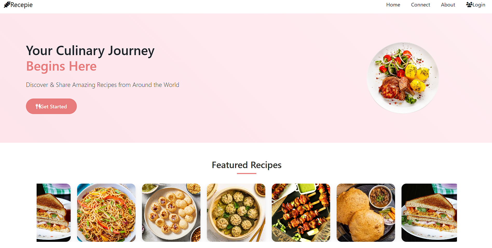
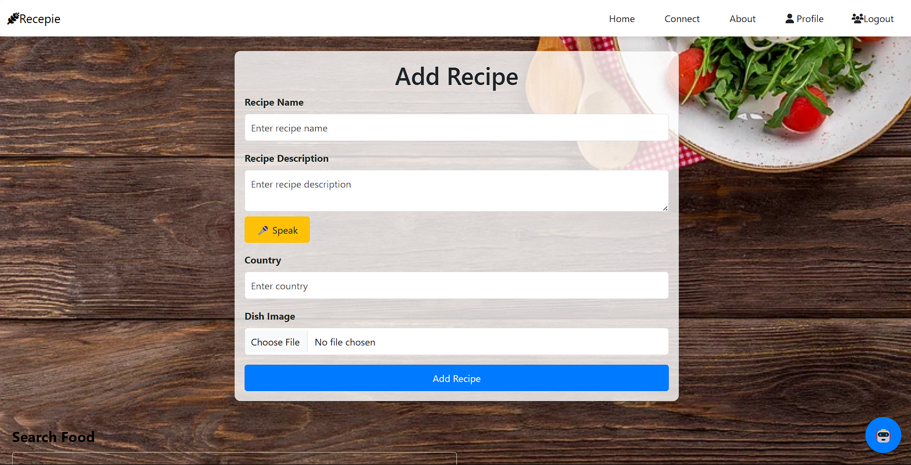
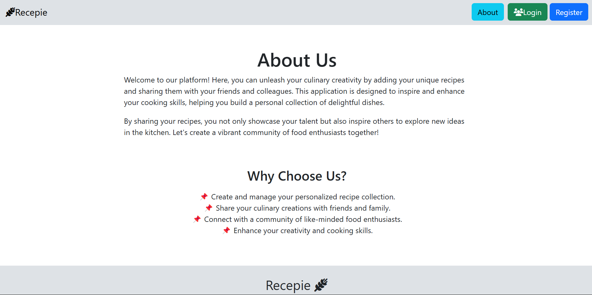
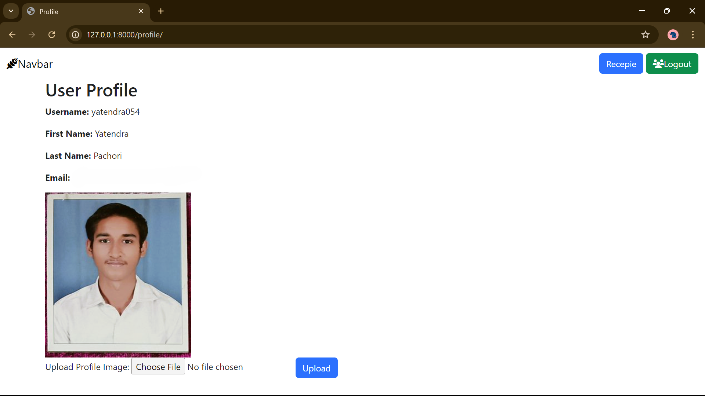

# Add-Recipe-backend

This project is a web application built with **Django** for the backend and **Bootstrap** for the frontend. The application allows users to create, manage, and share recipes with other users. It also provides social features such as following users, liking and commenting on recipes, video-based recipes, and an integrated AI assistant.

## About

If you're new to the application, begin by navigating to the registration page to create an account with your username and password. Once registered, you can log in and start managing your recipes from your profile.

Users can add, update, and delete their own recipes. They can also add recipe videos, organize recipes into different categories, and explore recipes shared by other users.

The application provides social features that allow users to follow other recipe creators, like recipes, comment on recipes, and share their profiles. Users can also explore the most trending recipes based on user engagement.

The application also includes an integrated **AI Assistant** that provides an interactive experience. Users can ask the assistant questions related to recipes, ingredients, cooking methods, and other recipe-related topics.

**Redis** is used for caching frequently accessed recipe and trending content, which helps reduce repeated database queries and improves application performance.












## Features

- User registration and login.
- Add, update, and delete recipes.
- Upload and share recipe videos.
- Categorize recipes for easy discovery.
- Follow other users and explore their recipes.
- Like and comment on recipes.
- Share user profiles.
- Explore trending recipes.
- Integrated AI Assistant for interactive recipe-related queries.
- Redis caching for frequently accessed content.

## Live 
Code version is live [here](https://add-recipe-backennd.onrender.com/)


1. **Install Dpendencies**
   
   ```
   pip install
   ```
3. **For Deployment**

   ```
   install gunicorn
   gunicorn your_project_name:wsgi
   ```
## Contribute

I welcome you to join us in making this project even better.By adding some more features.
   
