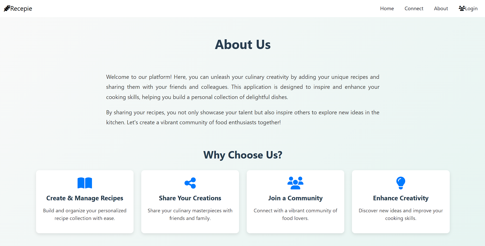
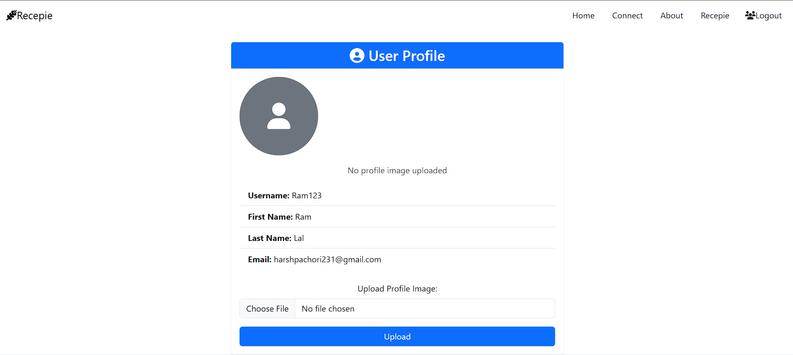

# Add-Recipe-backend

This project is a web application built with Django for the backend and Bootstrap for the frontend. The application allows users to easily add, delete, and update recipes.Project file is recepe.

## About
If you're new to the application, begin by navigating to the registration page to create an account with your username and password. Your username will be sent to your email as a reminder. Once registered, you can log in and start managing your recipes. You can add, delete, and update recipes in your profile. Additionally, you can share your profile with colleagues and explore the most trending dishes in the web application. The application also categorizes recipes, allowing you to easily find what you're looking for based on different categories. You can use the assistant for more information.



You can update your recepie and delete it from your profile. Also Integrated Ai assistant feature which help to user interactive.
You can ask any thing with assistant.



## Live 
Code version is live [here](https://add-recipe-backennd.onrender.com/)


1. **Install Dpendencies**
   
   ```
   pip install
   ```
3. **For Deployment**

   ```
   install gunicorn
   gunicorn your_project_name:wsgi
   ```
## Contribute

I welcome you to join us in making this project even better.By adding some more features.
   
